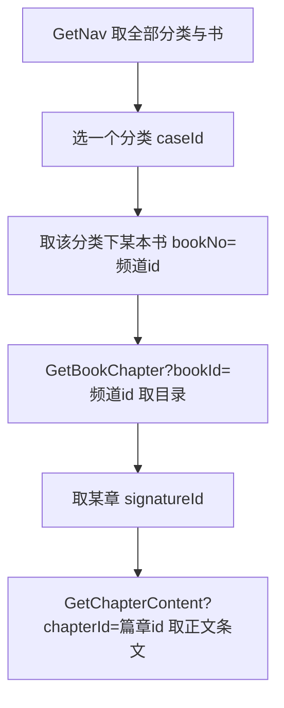

# 移动端真实取数流程（006 工单复验）

> 目的：按用户要求，**不靠数据模型推断**，而是实际走一遍移动端/前端的取数链路，
> 把「标签 → 书 → 目录 → 内容」每一步的真实端点、参数、返回形状固定成文档，
> 作为后续修复导入脚本的依据。
>
> 所有证据均来自对线上站点 `https://feed.881019.xyz`（已部署的 `feature/tcm-import`）
> 的真实 `curl`/请求抓取，时间 2026-09-28。

---

## 1. 四条链路总览



四个端点都在匿名命名空间 `/api/AppBookRequest/` 下，无需登录，中间件已放行。
每个端点返回统一信封 `{code, msg, data}`（`GetTipsStyleConfig` 除外，裸 `{styles}`）。
全部用 `GET`，注意 Astro 对 API 路由有 trailing-slash 308 跳转，调用端需跟随（`curl -L`）。

---

## 2. 每一步的真实形状（实测 + `src/server/tcm/reads.ts` 对照）

### 步骤 1 — GetNav：分类 → 书

- 请求：`GET /api/AppBookRequest/GetNav`
- 返回 `data` 是**数组**，每个元素是分类：

```jsonc
{
  "code": 200,
  "data": [
    {
      "caseId": "1runoCsI7dr",        // 分类 id（= channel.genre）
      "name": "伤寒",                 // 分类名
      "navList": [                    // 该分类下的书
        {
          "bookNo": "q6u5siNb2hT",    // ⚠️ 这就是下一句的 bookId（频道 id）
          "imageUrl": null,
          "bookName": "伤寒金匮・(宋版)",
          "chengShu": null,
          "author": null,
          "caseTag": 5,               // App 按此区分行为（5=伤寒显单位页）
          "desc": null,
          "chapterCount": 0            // ⚠️ 恒为 0（旧后端就注释掉了，照抄）
        }
      ]
    }
  ]
}
```

> 关键认知：**`bookNo` 就是书的「频道 id」**，下一步 `GetBookChapter?bookId=` 传的就是它。
> 不是按书名或 BookNo 数字查，而是按导入时生成的 11 位频道 id 查。

线上实测共 **6 个分类、20 本书**（见第 4 节证据表）。

### 步骤 2 — GetBookChapter：书 → 目录（篇章）

- 请求：`GET /api/AppBookRequest/GetBookChapter?bookId=<频道id>`
- 返回 `data` 是**数组**（不是 `{chapters:[...]}`），每个元素是篇章：

```jsonc
{
  "code": 200,
  "msg": "请求成功",
  "data": [
    {
      "bookId": "q6u5siNb2hT",
      "chapterSection": 0,            // 章序号（源 ChapterSection；null 时为 0）
      "chapterHeader": "赵开美翻刻宋板《伤寒论》…",
      "signatureId": "9lSFOt9wtL7"    // ⚠️ 这就是下一句的 chapterId（篇章条目 id）
    }
    // … 其余篇章
  ]
}
```

> 关键认知：**`signatureId` 就是篇章条目的 11 位 id**，下一步 `GetChapterContent?chapterId=` 传它。
> 排序按源章序号 `json_extract(data,'$._microfeed.section')` 升序。
> `status != 1` 的篇章不返回（已发布才进目录）。

### 步骤 3 — GetChapterContent：篇章 → 正文（条文）

- 请求：`GET /api/AppBookRequest/GetChapterContent?chapterId=<篇章id>`
- 返回 `data` 是**数组**，且只含 1 个元素（该篇章的聚合块）：

```jsonc
{
  "code": 200,
  "msg": "请求成功",
  "data": [
    {
      "section": 0,                  // 章序号
      "header": "金匮要略1  脏腑经络先后病",
      "signatureId": "9lSFOt9wtL7",  // 回显篇章 id
      "data": [                      // 该篇章下的逐条条文
        {
          "id": "5LShm6O3ONu",       // 条文条目 id
          "text": "1、问曰：上工治未病…$a{俞桥本…}…",  // 已反转 <p> 包装回原文；标记 $a{} 原样保留
          "note": null,
          "sectionvideo": null,
          "height": 0,
          "fangList": []              // 该条涉及的方剂名列表
        }
        // … 其余条文
      ]
    }
  ]
}
```

> 关键认知：条文按源 `receiptNo` 升序；`status = 3`（已删）不返回；
> `status = 4`（unlisted）对 App 可读。正文里的 `$x{...}` 标记**原样下发**（App 自己按 `GetTipsStyleConfig` 渲染）。

---

## 3. 这条链路的「关系」到底靠什么字段撑着

| 关系 | 真实载体（不是推断，是 reads.ts 里的 SQL） |
|---|---|
| 分类 → 书 | `ext_category.id = channels.genre`（频道表 `genre` 字段） |
| 书 → 篇章 | `items.book_id`（索引列）= 频道 id，且 `tcm_kind='chapter'` |
| 篇章 → 条文 | `items.tcm_parent_id`（列）= 篇章条目 id，且 `tcm_kind='section'` |

也就是说：**频道 membership 走 `book_id` 列；父子层级走 `tcm_parent_id` 列**。
这跟 `scripts/import-ctwh/build.ts` 的导入规则（spec §16.2）是一致的——导入时
篇章的 `book_id` 被设为它所属频道 id，条文的 `tcm_parent_id` 被设为它所属篇章的 id。

---

## 4. 实测证据表（线上 20 本书，逐本走 GetBookChapter）

`chaps` = 该书的篇章数（GetBookChapter 实返）；`secs₀` = 首章条文数；`首章` = 首章 `chapterHeader`。

| 分类 | 书名 | bookId | chaps | caseTag | secs₀ | 首章 header |
|---|---|---|---|---|---|---|
| 内经类 | 春灯旧梦 | BkB2y8qR3Mn | 0 | 0 | – | – |
| 内经类 | 难经 | tZYk25WiJ0R | 81 | 2 | 1 | 一难 |
| 内经类 | 黄帝内经・素问 | drsRImTi5tv | 81 | 2 | 29 | 上古天真论篇第一 |
| 内经类 | 黄帝内经・灵枢 | ghBqURJwurj | 81 | 2 | 17 | 九针十二原第一$a{法天} |
| 本草 | 药王归来 | BkC3z7rS4No | 0 | 0 | – | – |
| 本草 | 神农本草经疏 | OsOP62cyp3j | 79 | 3 | 1 | 梓行《本草疏》题辞 |
| 伤寒 | 雾城档案 | BkD4a6sT5Op | 0 | 0 | – | – |
| 伤寒 | 伤寒金匮・(宋版) | q6u5siNb2hT | **27** | 5 | 1 | **赵开美翻刻宋板《伤寒论》…（伤寒论内容）** |
| 伤寒 | 金匮要略・(宋版) | ydyQltIuQv6 | 22 | 5 | 17 | 金匮要略1 脏腑经络先后病 |
| 伤寒 | 伤寒杂病论・(桂林古本) | 5IGM9t76quT | 31 | 5 | 1 | 伤寒杂病论序(张机序) |
| 东方玄幻 | 夜航风暴 | BkA1x9pQ2Lm | 0 | 0 | – | – |
| 东方玄幻 | 天工开物录 | BkE5b5tU6Pq | 0 | 0 | – | – |
| 东方玄幻 | 长街听雪 | BkF6c4uV7Qr | 0 | 0 | – | – |
| 东方玄幻 | 星河剑歌 | J1jGJjUWeCz | 0 | 0 | – | – |
| 针灸 | 针灸大成 | dKffyz94UYv | **0** | 1 | – | – |
| 人纪 | 针灸篇・(人纪) | KPUT0E02Of0 | **0** | 9 | – | – |
| 人纪 | 伤寒论・(人纪) | XNK0VFX39Xv | 11 | 9 | 2 | 伤寒论原序 |
| 人纪 | 黄帝内经・(人纪) | t1l2c108tdP | **0** | 9 | – | – |
| 人纪 | 神农本草经・(人纪) | ZhuBd0Vj7kl | 7 | 9 | 1 | 自序 |
| 人纪 | 金匮要略・(人纪) | Kcb7X2K5LTh | 25 | 9 | 1 | 金匮上课前言 |

> 说明：caseTag=0 的四本（春灯旧梦 / 药王归来 / 雾城档案 / 四本玄幻）是**小说**，本来就没有
> 伤寒论式的「卷章」，返回 0 章是**正常**的。
> 真正异常的是下面三本**真中医书**返回 0 章：针灸大成、针灸篇・(人纪)、黄帝内经・(人纪)。

---

## 5. 这条链路暴露出的两个真问题（根因见 `issues/06b-root-cause.md`）

1. **书与卷章名实不符**：`伤寒金匮・(宋版)` 频道（q6u5siNb2hT）名下挂的是
   「赵开美翻刻宋板《伤寒论》…」这种**伤寒论**的 27 篇内容，而不是金匮内容。
   → 根因：源数据把 `BookNo=10001`（命名「伤寒金匮」）与 `BookId=10001`（内容「伤寒论」）
   **复用同一编号**，导入按编号关联，于是书名与内容错位。金匮内容本身在 `金匮要略・(宋版)`。

2. **三本真中医书整本无卷**：针灸大成 / 针灸篇・(人纪) / 黄帝内经・(人纪) 走 GetBookChapter 返回 0 章。
   → 经核对源 `ctwh/Book.sql`，这三本书的 `BookNo`（100100 / 9010000 / 9030000）
   **在源里根本没有任何篇章行**（源 `Book` 表只有 10 个 `BookId`，不含这三个）。
   这是**源数据缺失**，不是导入脚本的关联写错——脚本忠实地只导入了源里有的内容。

---

## 6. 下一步

- 流程与证据已固定（本文件 + `evidence/` 下原始 JSON）。
- 见 `issues/06b-root-cause.md` 决定脚本侧修复（主要为「伤寒金匮→伤寒论」正名 + 把「有书无章」的源缺口在导入报告里显式告警）。
- 远程重灌受 D1 免费额度限制（每日写行配额 2026-09-29 00:00 UTC 重置）；脚本修好先在本地 dry-run 验证，再择机重灌。
